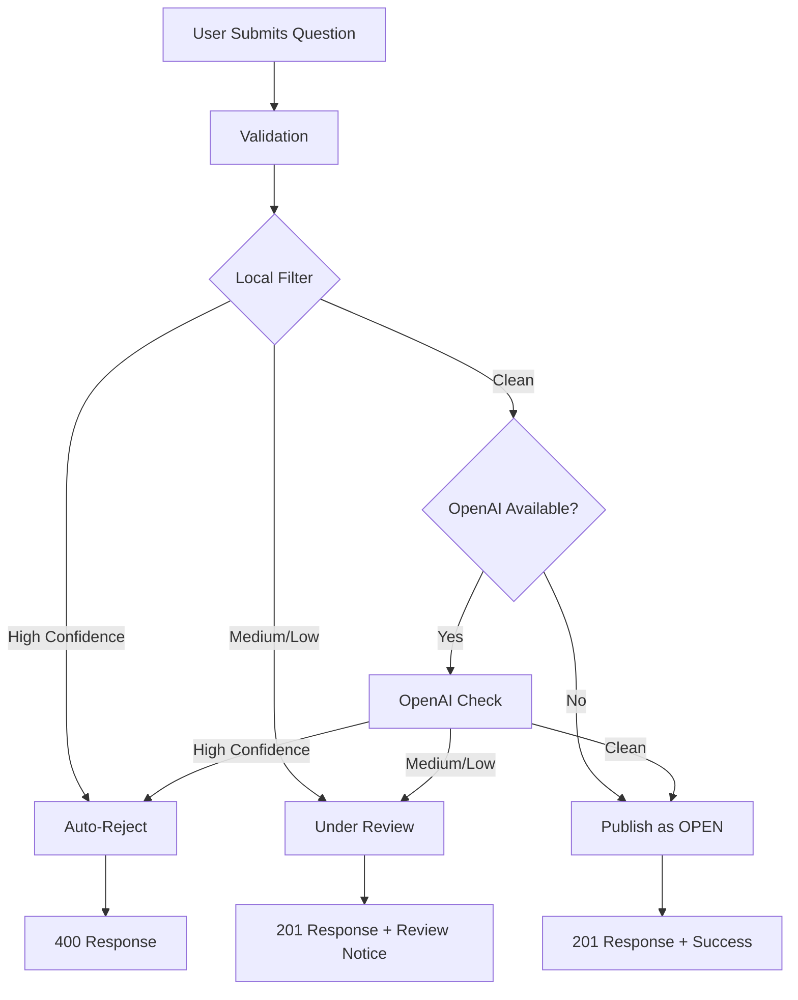

# Content Moderation

PulseStage includes built-in content moderation to protect your community from inappropriate content, spam, and abuse.

## Overview

The moderation system uses a **cascading filter approach**:

1. **Local Filter** (Always Active)
   - Profanity detection
   - Spam pattern recognition
   - Hate speech detection
   - Excessive capitalization
   - No configuration required
   - Zero API costs
   - Instant processing

2. **OpenAI Moderation** (Optional)
   - Context-aware AI analysis
   - Advanced toxicity detection
   - Hate speech, harassment, self-harm detection
   - Requires API key
   - Very low cost (~$0.002 per 1K tokens)
   - Only runs if `OPENAI_API_KEY` is configured

Content is **flagged if either filter flags it**, providing comprehensive protection.

## How It Works

### Tiered Moderation System

PulseStage uses a **3-tier moderation system** to balance protection with user experience:

1. **High Confidence Violations** → Auto-Reject
   - Clear profanity, hate speech, spam
   - User receives immediate feedback with reasons
   - Question is NOT created

2. **Medium/Low Confidence Flags** → Under Review
   - Borderline content, false positive risk
   - Question created with `UNDER_REVIEW` status
   - Sent to moderator queue
   - User notified of pending review

3. **Clean Content** → Published
   - No flags from any provider
   - Immediately published as `OPEN`
   - Visible to all users

### Question Submission Flow



### What Gets Checked

- **Profanity**: Common profane language
- **Spam**: Repeated characters, excessive URLs, spam keywords
- **Hate Speech**: Slurs, derogatory language, harmful content
- **Toxicity**: Aggressive, harassing, or threatening tone
- **Self-Harm**: Content promoting self-harm
- **Harassment**: Personal attacks, bullying

## Configuration

### Local-Only (Default)

No configuration needed. Works out of the box:

```bash
# env.example - no moderation configuration required
# Local filtering is automatically active
```

### With OpenAI Enhancement

Add your OpenAI API key for enhanced moderation:

```bash
# Optional: Enhanced AI moderation
OPENAI_API_KEY=sk-...
```

**Get an API key**: [https://platform.openai.com/api-keys](https://platform.openai.com/api-keys)

### Security Best Practices

#### Protecting Your API Key

1. **Server-Side Only**: Never expose `OPENAI_API_KEY` to frontend
2. **Separate Keys**: Use different keys for dev/demo/production
3. **Rate Limiting**: Already implemented (10 questions/min per IP)
4. **Usage Monitoring**: Set spending limits in OpenAI dashboard
5. **Environment Variables**: Never commit keys to git (.gitignore configured)

#### Recommended Setup

**Demo/Development**:
```bash
# Use local-only filtering
# No API key needed
```

**Production**:
```bash
# Add OpenAI for enhanced protection
OPENAI_API_KEY=sk-...
# Set spending limit: $10/month (very generous for most use cases)
```

## Cost Analysis

### Local Filtering
- **Cost**: $0 (100% free)
- **Speed**: <1ms per question
- **Accuracy**: ~85-90% for obvious violations

### OpenAI Moderation API
- **Cost**: ~$0.002 per 1,000 tokens
- **Speed**: ~200ms per question
- **Accuracy**: ~95-98% with context awareness

### Example Costs

| Questions/Month | Local Only | Local + OpenAI |
|----------------|------------|----------------|
| 1,000          | $0.00      | $0.40          |
| 10,000         | $0.00      | $4.00          |
| 100,000        | $0.00      | $40.00         |

**Caching**: Results are cached to avoid duplicate API calls for identical content.

## API Response

### Successful Submission

```http
POST /questions
Content-Type: application/json

{
  "body": "What is our remote work policy?"
}

→ 201 Created
```

### Moderation Failure

```http
POST /questions
Content-Type: application/json

{
  "body": "This is some fucking bullshit"
}

→ 400 Bad Request
{
  "error": "Content does not meet community guidelines",
  "reasons": [
    "Contains profanity"
  ],
  "moderationId": "mod_1760054757000"
}
```

### Using the Moderation ID

The `moderationId` can be used for:
- **Support Requests**: Users can appeal moderation decisions
- **Audit Logging**: Track moderation patterns
- **False Positive Reports**: Improve filter accuracy

## Moderator Review Workflow

Questions flagged with **medium or low confidence** are sent to a review queue for human moderation.

### Review Queue Access

Moderators (users with `question.answer` permission) can access the review queue:

1. **Admin Panel** → Navigate to Moderation Queue
2. **Status Filter** → Select "Under Review"
3. View all pending questions with:
   - Original question text
   - Moderation reasons
   - Confidence level
   - Flagging providers (local, openai)
   - Team assignment
   - Submission timestamp

### Moderator Actions

#### Approve Question

Publishes the question and makes it visible to all users:

```http
POST /admin/moderation/approve/{questionId}
Authorization: Bearer {session}

→ 200 OK
{
  "status": "OPEN",
  "message": "Question approved and published"
}
```

**What happens:**
- Question status changes from `UNDER_REVIEW` → `OPEN`
- Question appears in public browse page
- Real-time SSE event (`question:created`) notifies connected clients
- Audit log records approval action
- `reviewedBy` and `reviewedAt` fields are set

#### Reject Question

Removes the question permanently:

```http
POST /admin/moderation/reject/{questionId}
Authorization: Bearer {session}
Content-Type: application/json

{
  "reason": "Inappropriate content"
}

→ 200 OK
{
  "message": "Question rejected and removed",
  "questionId": "..."
}
```

**What happens:**
- Question is permanently deleted from database
- Audit log captures rejection with:
  - Original question text
  - Moderation reasons
  - Moderator's rejection reason
  - Moderator user ID
  - Timestamp
- No notification to other clients (question never existed publicly)

### API Endpoints

#### List Questions Under Review

```http
GET /admin/moderation/review-queue
Authorization: Bearer {session}
Query Parameters:
  - teamId (optional): Filter by team
  - confidence (optional): Filter by confidence level (high, medium, low)

→ 200 OK
[
  {
    "id": "...",
    "body": "Question text",
    "status": "UNDER_REVIEW",
    "moderationReasons": ["Borderline toxic language"],
    "moderationConfidence": "medium",
    "moderationProviders": ["local"],
    "teamId": "...",
    "createdAt": "2025-01-10T10:30:00Z"
  }
]
```

### User Experience

#### When Question Is Under Review

User sees:
```
✓ Your question has been submitted and is under moderator review.
  You'll be notified once it's published.
```

The question:
- ✅ Is saved to database
- ✅ Has `UNDER_REVIEW` status
- ❌ Does NOT appear in public browse page
- ❌ Does NOT appear in search results
- ❌ Is NOT visible to other users

#### After Approval

- Question appears immediately in public browse page
- Real-time updates via SSE
- No additional notification to author (they see it published)

#### After Rejection

- Question is deleted
- No public record
- Author does not receive automatic notification
  - (Future enhancement: email notification with appeal option)

### Audit Logging

All moderation actions are logged for transparency and compliance:

#### Logged Events

1. **`question.moderation.flagged`**
   - Triggered when content is initially flagged
   - Metadata: reasons, confidence, providers, question preview

2. **`question.moderation.under_review`**
   - Triggered when question is sent to review queue
   - Metadata: questionId, teamId, reasons, confidence

3. **`question.moderation.approved`**
   - Triggered when moderator approves a question
   - Metadata: questionId, reviewerId, timestamp

4. **`question.moderation.rejected`**
   - Triggered when moderator rejects a question
   - Metadata: questionId, reviewerId, rejectionReason, originalQuestionText

#### Querying Audit Logs

```sql
-- View all moderation events
SELECT action, "entityType", metadata, "createdAt"
FROM "AuditLog"
WHERE action LIKE '%moderation%'
ORDER BY "createdAt" DESC;

-- Count flagged questions by provider
SELECT 
  metadata->>'providers' as providers,
  COUNT(*) 
FROM "AuditLog"
WHERE action = 'question.moderation.flagged'
GROUP BY metadata->>'providers';
```

## Testing

### Running Moderation Tests

**Local filter tests** (no database required):
```bash
cd api
npm test -- --config=vitest.moderation.config.ts
```

**Full workflow tests** (includes database):
```bash
cd api
npm test src/lib/moderation/moderationWorkflow.test.ts
```

Tests include:
- ✅ Profanity detection
- ✅ Spam pattern recognition
- ✅ Hate speech detection
- ✅ Excessive capitalization
- ✅ OpenAI integration (when key is available)
- ✅ Error handling and graceful degradation
- ✅ Tiered moderation (auto-reject vs under review)
- ✅ Review queue operations (list, approve, reject)
- ✅ Audit logging for all moderation actions

### Manual Testing

**Test with local filter**:
```bash
# Profanity
curl -X POST http://localhost:3000/questions \
  -H "Content-Type: application/json" \
  -d '{"body": "Why is this shit so broken?"}'
```

**Test with clean content**:
```bash
curl -X POST http://localhost:3000/questions \
  -H "Content-Type: application/json" \
  -d '{"body": "How do I submit a PTO request?"}'
```

## Monitoring

### Logs

Moderation events are logged with details:

```
Content flagged by moderation: {
  providers: ['local', 'openai'],
  reasons: ['Contains profanity', 'Hate speech detected'],
  confidence: 'high',
  preview: 'This is some fucking...'
}
```

### Metrics to Track

- **Flagged Rate**: % of questions flagged
- **False Positives**: User reports of incorrect flags
- **Provider Distribution**: Local vs OpenAI catches
- **Cost**: OpenAI API usage (if enabled)

## Customization

### Adjusting Sensitivity

Edit `api/src/lib/moderation/localFilter.ts`:

```typescript
// More lenient: Require higher caps ratio
const capsRatio = (text.match(/[A-Z]/g) || []).length / text.replace(/\s/g, '').length
if (capsRatio > 0.7 && text.length > 20) {  // Was 0.6
  reasons.push('Excessive capitalization')
}
```

### Adding Custom Patterns

```typescript
// api/src/lib/moderation/localFilter.ts
const customPatterns = [
  /\b(custom|banned|phrase)\b/gi,
]

for (const pattern of customPatterns) {
  if (pattern.test(text)) {
    reasons.push('Custom policy violation')
    break
  }
}
```

### Whitelisting

For trusted users or specific contexts:

```typescript
// In app.ts, before moderation check
if (req.user?.role === 'admin' || req.user?.role === 'moderator') {
  // Skip moderation for trusted roles
}
```

## Alternatives

### Perspective API (Google)

Free alternative to OpenAI:

```typescript
// api/src/lib/moderation/perspectiveFilter.ts
import { google } from 'googleapis'

const perspective = google.perspective('v1alpha1')
// Implement Perspective API integration
```

**Pros**: Free (1 QPS), similar quality
**Cons**: Requires Google Cloud setup

### Custom ML Models

For enterprise deployments:

- Train on your specific domain
- Host locally for zero API costs
- Full control over accuracy/sensitivity

## Troubleshooting

### "Content flagged" but seems appropriate

**Cause**: False positive from local filter
**Solution**: 
1. Add OpenAI key for better context awareness
2. Adjust local filter sensitivity
3. Implement appeal process

### OpenAI API errors

**Symptoms**: 
```
OpenAI moderation API error: AuthenticationError: 401
```

**Solutions**:
1. Verify `OPENAI_API_KEY` is set correctly
2. Check key hasn't expired
3. Confirm spending limits not exceeded
4. System gracefully falls back to local-only

### High API costs

**Solutions**:
1. Implement caching (already included)
2. Use local filter first, OpenAI only for edge cases
3. Adjust rate limiting to reduce volume
4. Set OpenAI usage limits

## Further Reading

- [OpenAI Moderation API Documentation](https://platform.openai.com/docs/guides/moderation)
- [Content Policy Best Practices](./overview.md)
- [Rate Limiting](./rate-limiting.md)
- [Audit Logging](./audit-logging.md)

